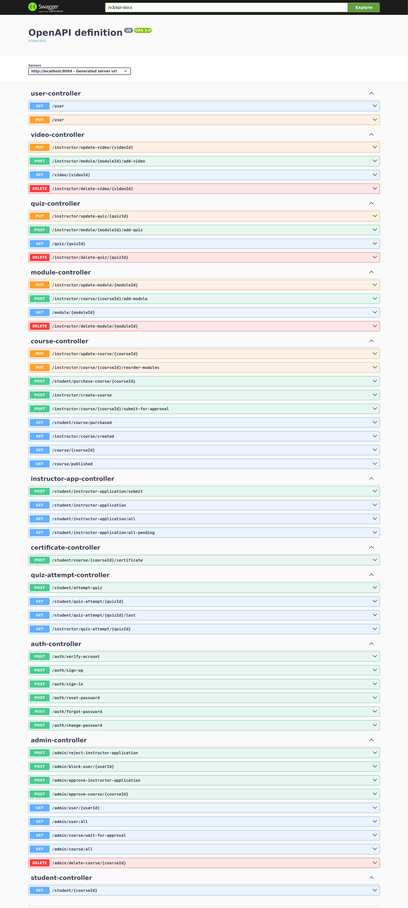

# ilim-backend

Welcome to the **ilim-backend**! 
So far, the server provides authentication and user management services using AWS Cognito, AWS SDK, and PostgreSQL, with good exception handling.


## Prerequisites
Before you begin, ensure you have the following installed on your local development machine:

- **Java Development Kit (JDK) 21** or higher
- **Maven** for building the project
- **Git** for version control
- **Docker && Docker Compose** for running PostgreSQL locally

##  How to Run the Server locally
1. **Setting up your local environment**
   1. Create `./src/main/resources/application-local.properties`
   2. Put these properties inside it
    ```yaml
    spring.datasource.url=jdbc:postgresql://localhost:5432/ilim-local-db
    spring.datasource.username=postgres
    spring.datasource.password=postgres
    spring.datasource.driver-class-name=org.postgresql.Driver
    
    # JPA and Hibernate
    spring.jpa.hibernate.ddl-auto=update
    spring.jpa.show-sql=true
    ```
   3. Open your terminal and navigate to `./devops/local-db`
   4. Run this command to start the PostgreSQL Container:
      ```bash
      docker-compose up -d
      ```
2. **Setting Up AWS Account and infrastructure** 
   1. Go to the root directory of this project then open 'devops/setting-up-aws.md' using any markdown viewer.
   2. Follow the instructions there and complete `application-local.properties`.

3. Start the server from IntelliJ or using build it using maven and run the JAR file.

Note: To build it in dev environment
```bash
./mvnw clean package -DskipTests -P dev
```

---
## Project Overview

The **ilim** application is a backend service that handles user authentication and profile management. It leverages:

- **AWS Cognito** for user authentication and authorization.
- **AWS SDK for Java** to interact with AWS services.
- **Spring Boot** as the application framework.
- **PostgreSQL** as the local development database.
- **AWS CloudFormation** to provision AWS resources.
- **Docker Compose** for the DB in the local env.

---


## Testing and Development

- **API Endpoints**: You can see (and try) all the available API endpoints by going to `http://localhost:8099/swagger-ui/index.html` after starting the server.
For Example:


- You can also use tools like **Bruno** or **Postman** for testing the API.

---

## AWS Notes

- **Cognito User Pool**:

  - The free tier of AWS Cognito is 50-sign up per day. Do not exceed that to stay free of charge.


## Implementation Details

- User(name, email, birthdate) are unmodifiable in the current implementation, because this is how we defined the Cognito stack, this can be changed if needed.
- When a user account gets verified, it gets created in the database, otherwise it will stay in cognito as 'unconfirmed'.

---

**Development Approach:**

- **Development Environment:**
  - Run the server and database locally.
  - Use local configurations and keep your development cycle efficient.

- **Production Environment:**
  - We will deploy the server to an EC2 instance in a public subnet.
  - Will put the RDS instance in a private subnet.
  - Will secure resources using security groups and IAM roles.

- **Common in both Environment**:
  - AWS Cognito
  - AWS S3

- **Why we have two different DB instances in the local and dev environments?**
    - Avoid any credential cost in AWS.
    - Much faster and simpler development, since you don't need to wait for every little change to get deployed to AWS EC2.
    - Much more secure since this way we won't need to expose AWS RDS publicly.