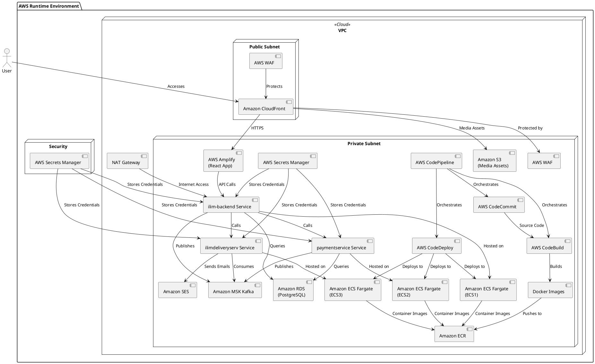

```plantuml
@startuml
!define RECTANGLE class

' Define the User as an actor with a stickman
actor User

package "AWS Runtime Environment" {
    node "VPC" <<Cloud>> {

        ' Define Public Subnet
        node "Public Subnet" {
            [Amazon CloudFront] as CloudFront
            [AWS WAF] as WAFSecurity
        }

        ' Define Private Subnet
        node "Private Subnet" {
            [AWS Amplify\n(React App)] as Amplify
            [Amazon S3\n(Media Assets)] as S3Media
            [AWS WAF] as WAF

            [ilim-backend Service] as ilimBackend
            [paymentservice Service] as paymentservice
            [ilimdeliveryserv Service] as ilimdeliveryserv
            [Amazon RDS\n(PostgreSQL)] as RDS
            [Amazon MSK Kafka] as Kafka
            [Amazon SES] as SES

            [Amazon ECS Fargate\n(ECS1)] as ECS1
            [Amazon ECS Fargate\n(ECS2)] as ECS2
            [Amazon ECS Fargate\n(ECS3)] as ECS3
            [Amazon ECR] as ECR
            [AWS Secrets Manager] as SecretsManager

            [AWS CodeCommit] as CodeCommit
            [AWS CodeBuild] as CodeBuild
            [Docker Images] as DockerImages
            [AWS CodeDeploy] as CodeDeploy
            [AWS CodePipeline] as CodePipeline
        }

        [NAT Gateway] as NATGateway
    }

    node "Security" {
        [AWS Secrets Manager] as SecretsManagerSecurity
    }

}
' Connections

' Connect User to CloudFront (Entry Point)
User --> CloudFront : Accesses

' Frontend connections
CloudFront --> Amplify : HTTPS
CloudFront --> S3Media : Media Assets
CloudFront --> WAF : Protected by

Amplify --> ilimBackend : API Calls

' Backend connections
ilimBackend --> paymentservice : Calls
ilimBackend --> ilimdeliveryserv : Calls
ilimBackend --> RDS : Queries
ilimBackend --> Kafka : Publishes

paymentservice --> RDS : Queries
paymentservice --> Kafka : Publishes

ilimdeliveryserv --> Kafka : Consumes
ilimdeliveryserv --> SES : Sends Emails

' AWS Services connections
ilimBackend --> ECS1 : Hosted on
paymentservice --> ECS2 : Hosted on
ilimdeliveryserv --> ECS3 : Hosted on

ECS1 --> ECR : Container Images
ECS2 --> ECR : Container Images
ECS3 --> ECR : Container Images

SecretsManager --> ilimBackend : Stores Credentials
SecretsManager --> paymentservice : Stores Credentials
SecretsManager --> ilimdeliveryserv : Stores Credentials

WAFSecurity --> CloudFront : Protects
SecretsManagerSecurity --> ilimBackend : Stores Credentials
SecretsManagerSecurity --> paymentservice : Stores Credentials
SecretsManagerSecurity --> ilimdeliveryserv : Stores Credentials

' CI/CD connections
CodeCommit --> CodeBuild : Source Code
CodeBuild --> DockerImages : Builds
DockerImages --> ECR : Pushes to
CodeDeploy --> ECS1 : Deploys to
CodeDeploy --> ECS2 : Deploys to
CodeDeploy --> ECS3 : Deploys to
CodePipeline --> CodeCommit : Orchestrates
CodePipeline --> CodeBuild : Orchestrates
CodePipeline --> CodeDeploy : Orchestrates

' NAT Gateway connection (optional, depending on your architecture)
NATGateway --> ilimBackend : Internet Access

@enduml

```