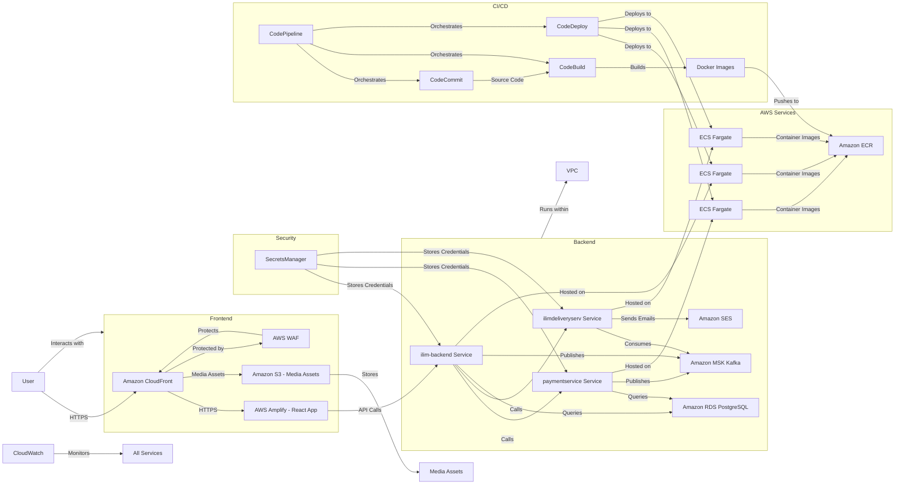

```mermaid
graph LR
  User[User] -->|HTTPS| CloudFront[Amazon CloudFront]

  subgraph Frontend
    CloudFront -->|HTTPS| Amplify[AWS Amplify - React App]
    CloudFront -->|Media Assets| S3Media[Amazon S3 - Media Assets]
    CloudFront -->|Protected by| WAF[AWS WAF]
  end

  subgraph Backend
    Amplify -->|API Calls| ilimBackend[ilim-backend Service]
    ilimBackend -->|Calls| paymentservice[paymentservice Service]
    ilimBackend -->|Calls| ilimdeliveryserv[ilimdeliveryserv Service]
    ilimBackend -->|Queries| RDS[Amazon RDS PostgreSQL]
    ilimBackend -->|Publishes| Kafka[Amazon MSK Kafka]
    paymentservice -->|Queries| RDS
    paymentservice -->|Publishes| Kafka
    ilimdeliveryserv -->|Consumes| Kafka
    ilimdeliveryserv -->|Sends Emails| SES[Amazon SES]
  end

  subgraph AWS Services
    ilimBackend -->|Hosted on| ECS1[ECS Fargate]
    paymentservice -->|Hosted on| ECS2[ECS Fargate]
    ilimdeliveryserv -->|Hosted on| ECS3[ECS Fargate]
    ECS1 & ECS2 & ECS3 -->|Container Images| ECR[Amazon ECR]
    RDS
    Kafka
    SES
    WAF
  end

  subgraph Security
    WAF -->|Protects| CloudFront
    SecretsManager -->|Stores Credentials| ilimBackend
    SecretsManager -->|Stores Credentials| paymentservice
    SecretsManager -->|Stores Credentials| ilimdeliveryserv
  end

  subgraph CI/CD
    CodeCommit -->|Source Code| CodeBuild
    CodeBuild -->|Builds| DockerImages[Docker Images]
    DockerImages -->|Pushes to| ECR
    CodeDeploy -->|Deploys to| ECS1 & ECS2 & ECS3
    CodePipeline -->|Orchestrates| CodeCommit & CodeBuild & CodeDeploy
  end

  User -->|Interacts with| Frontend

  Backend -->|Runs within| VPC

  S3Media -->|Stores| MediaAssets[Media Assets]

  CloudWatch -->|Monitors| AllServices[All Services]

```