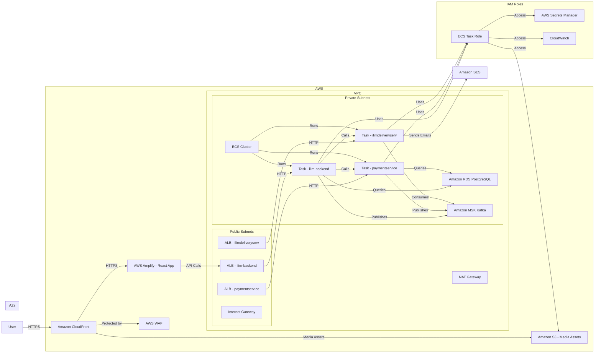

```mermaid
graph LR
  subgraph AWS
    subgraph VPC
      subgraph Public Subnets
        ALB1[ALB - ilim-backend]
        ALB2[ALB - paymentservice]
        ALB3[ALB - ilimdeliveryserv]
        IGW[Internet Gateway]
      end
      subgraph Private Subnets
        ECSCluster[ECS Cluster]
        ilimBackendTask[Task - ilim-backend]
        paymentserviceTask[Task - paymentservice]
        ilimdeliveryservTask[Task - ilimdeliveryserv]
        RDS[Amazon RDS PostgreSQL]
        MSK[Amazon MSK Kafka]
      end
      NAT[NAT Gateway]
    end
    CloudFront[Amazon CloudFront]
    Amplify[AWS Amplify - React App]
    S3Media[Amazon S3 - Media Assets]
    WAF[AWS WAF]
  end

  User[User] -->|HTTPS| CloudFront
  CloudFront -->|HTTPS| Amplify
  CloudFront -->|Media Assets| S3Media
  CloudFront -->|Protected by| WAF

  Amplify -->|API Calls| ALB1

  ALB1 -->|HTTP| ilimBackendTask
  ALB2 -->|HTTP| paymentserviceTask
  ALB3 -->|HTTP| ilimdeliveryservTask

  ilimBackendTask -->|Calls| paymentserviceTask
  ilimBackendTask -->|Calls| ilimdeliveryservTask
  ilimBackendTask -->|Queries| RDS
  ilimBackendTask -->|Publishes| MSK

  paymentserviceTask -->|Queries| RDS
  paymentserviceTask -->|Publishes| MSK

  ilimdeliveryservTask -->|Consumes| MSK
  ilimdeliveryservTask -->|Sends Emails| SES[Amazon SES]

  ECSCluster -->|Runs| ilimBackendTask
  ECSCluster -->|Runs| paymentserviceTask
  ECSCluster -->|Runs| ilimdeliveryservTask

  subgraph IAM Roles
    ECSRole[ECS Task Role]
    ECSRole -->|Access| SecretsManager[AWS Secrets Manager]
    ECSRole -->|Access| S3Media
    ECSRole -->|Access| CloudWatch
  end

  ilimBackendTask -->|Uses| ECSRole
  paymentserviceTask -->|Uses| ECSRole
  ilimdeliveryservTask -->|Uses| ECSRole

  subgraph AZs
    ilimBackendTask
    paymentserviceTask
    ilimdeliveryservTask
    RDS
    MSK
  end

```