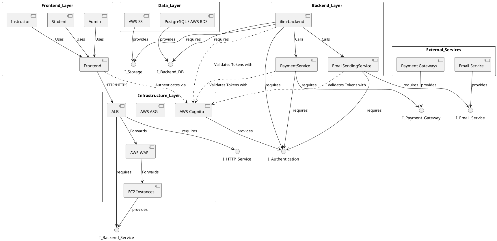

```plantuml
@startuml

skinparam packageStyle rectangle
skinparam componentStyle uml2
skinparam interfaceStyle rectangle

' Define Interfaces
interface "I_HTTP_Service" as http_service
interface "I_Authentication" as auth
interface "I_Backend_Service" as backend_service
interface "I_Backend_DB" as db_interface
interface "I_Storage" as storage_interface
interface "I_Payment_Gateway" as payment_gateway_interface
interface "I_Email_Service" as email_service_interface

' Frontend_Layer Package
package "Frontend_Layer" {
    [Student]
    [Instructor]
    [Admin]

    [Student] --> [Frontend] : Uses
    [Instructor] --> [Frontend] : Uses
    [Admin] --> [Frontend] : Uses
}

' Infrastructure Layer
package "Infrastructure_Layer" {
    component "ALB" as ALB
    component "AWS WAF" as WAF
    component "EC2 Instances" as EC2
    component "AWS ASG" as ASG
    component "AWS Cognito" as Cognito

    ALB --> http_service : requires
    EC2 --> backend_service : provides
    ALB --> backend_service : requires
    Cognito --> auth : provides

    Frontend --> ALB : HTTP/HTTPS
    ALB --> WAF : Forwards
    WAF --> EC2 : Forwards
}

' Backend Layer
package "Backend_Layer" {
    component "ilim-backend" as Backend
    component "PaymentService" as PaymentService
    component "EmailSendingService" as EmailService

    Backend --> db_interface : requires
    Backend --> storage_interface : requires
    Backend --> auth : requires

    Backend --> PaymentService : Calls
    Backend --> EmailService : Calls

    PaymentService --> payment_gateway_interface : requires
    PaymentService --> auth : requires

    EmailService --> email_service_interface : requires
    EmailService --> auth : requires
}

' Data Layer
package "Data_Layer" {
    component "PostgreSQL / AWS RDS" as Database
    component "AWS S3" as Storage

    Database --> db_interface : provides
    Storage --> storage_interface : provides
}

' External Services
package "External_Services" {
    component "Payment Gateways" as PaymentGateway
    component "Email Service" as ExternalEmailService

    PaymentGateway --> payment_gateway_interface : provides
    ExternalEmailService --> email_service_interface : provides
}

' Authentication Interactions
Frontend ..> Cognito : Authenticates via
Backend ..> Cognito : Validates Tokens with
PaymentService ..> Cognito : Validates Tokens with
EmailService ..> Cognito : Validates Tokens with

@enduml


```