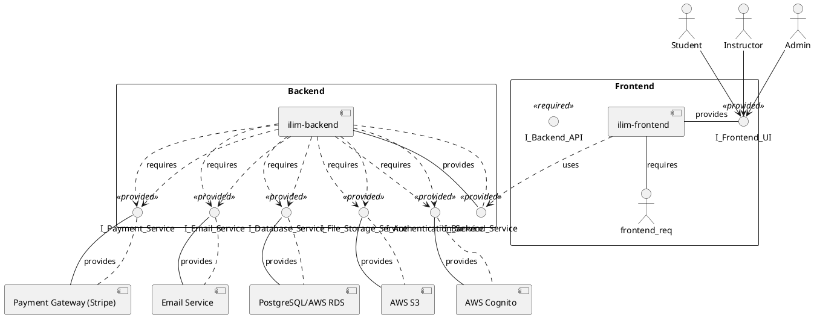

```plantuml
@startuml
' Skin parameters for better visual appearance
skinparam componentStyle uml2
skinparam interfaceStyle uml2
skinparam packageStyle rectangle

' Actors
actor "Student" as student
actor "Instructor" as instructor
actor "Admin" as admin

' Frontend Component
package "Frontend" {
    component "ilim-frontend" as frontend

    ' Provided and Required Interfaces
    interface "I_Frontend_UI" as I_Frontend_UI <<provided>>
    interface "I_Backend_API" as I_Backend_API <<required>>

    frontend -right- I_Frontend_UI : provides
    frontend_req -up- frontend : requires

    ' Users interact with the frontend
    student --> I_Frontend_UI
    instructor --> I_Frontend_UI
    admin --> I_Frontend_UI
}

' Backend Component
package "Backend" {
    component "ilim-backend" as backend

    ' Provided and Required Interfaces
    interface "I_Backend_Service" as I_Backend_Service <<provided>>
    interface "I_Authentication_Service" as I_Authentication_Service <<required>>
    interface "I_File_Storage_Service" as I_File_Storage_Service <<required>>
    interface "I_Database_Service" as I_Database_Service <<required>>
    interface "I_Email_Service" as I_Email_Service <<required>>
    interface "I_Payment_Service" as I_Payment_Service <<required>>

    backend -right- I_Backend_Service : provides

    ' Backend requires several services
    backend ..> I_Authentication_Service : requires
    backend ..> I_File_Storage_Service : requires
    backend ..> I_Database_Service : requires
    backend ..> I_Email_Service : requires
    backend ..> I_Payment_Service : requires
}

' AWS Cognito Component
component "AWS Cognito" as cognito
interface "I_Authentication_Service" as I_Authentication_Service <<provided>>
cognito -up- I_Authentication_Service : provides

' AWS S3 Component
component "AWS S3" as s3
interface "I_File_Storage_Service" as I_File_Storage_Service <<provided>>
s3 -up- I_File_Storage_Service : provides

' Database Component
component "PostgreSQL/AWS RDS" as database
interface "I_Database_Service" as I_Database_Service <<provided>>
database -up- I_Database_Service : provides

' Email Service Component
component "Email Service" as emailService
interface "I_Email_Service" as I_Email_Service <<provided>>
emailService -up- I_Email_Service : provides

' Payment Gateway Component
component "Payment Gateway (Stripe)" as paymentGateway
interface "I_Payment_Service" as I_Payment_Service <<provided>>
paymentGateway -up- I_Payment_Service : provides

' Connections between components
frontend ..> I_Backend_Service : uses
I_Backend_Service .. backend

backend ..> I_Authentication_Service
I_Authentication_Service .. cognito

backend ..> I_File_Storage_Service
I_File_Storage_Service .. s3

backend ..> I_Database_Service
I_Database_Service .. database

backend ..> I_Email_Service
I_Email_Service .. emailService

backend ..> I_Payment_Service
I_Payment_Service .. paymentGateway

@enduml

```