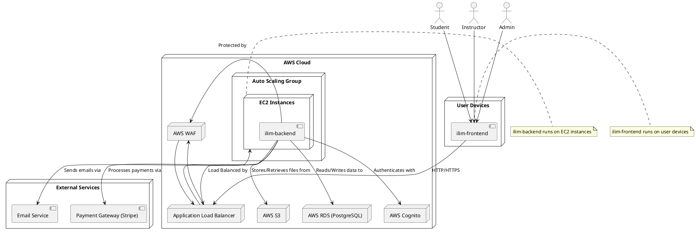

```plantuml
@startuml
' Skin parameters for better visual appearance
skinparam componentStyle uml2
skinparam nodeStyle uml2

' Users
actor "Student" as student
actor "Instructor" as instructor
actor "Admin" as admin

' Nodes
node "User Devices" {
    [ilim-frontend] as frontend
}

node "AWS Cloud" {
    node "AWS WAF" as waf
    node "Application Load Balancer" as alb
    node "Auto Scaling Group" as asg {
        node "EC2 Instances" as ec2 {
            [ilim-backend] as backend
        }
    }
    node "AWS Cognito" as cognito
    node "AWS S3" as s3
    node "AWS RDS (PostgreSQL)" as rds
}

node "External Services" {
    [Payment Gateway (Stripe)] as paymentGateway
    [Email Service] as emailService
}

' User interactions
student --> frontend
instructor --> frontend
admin --> frontend

' Frontend to AWS Cloud
frontend --> alb : HTTP/HTTPS
alb --> waf
waf --> alb
alb --> ec2

' Backend interactions
backend --> cognito : Authenticates with
backend --> s3 : Stores/Retrieves files from
backend --> rds : Reads/Writes data to
backend --> paymentGateway : Processes payments via
backend --> emailService : Sends emails via

' Additional AWS Services
backend --> waf : Protected by
backend --> alb : Load Balanced by

' Notes for clarity
note right of frontend
  ilim-frontend runs on user devices
end note

note right of ec2
  ilim-backend runs on EC2 instances
end note

@enduml

```