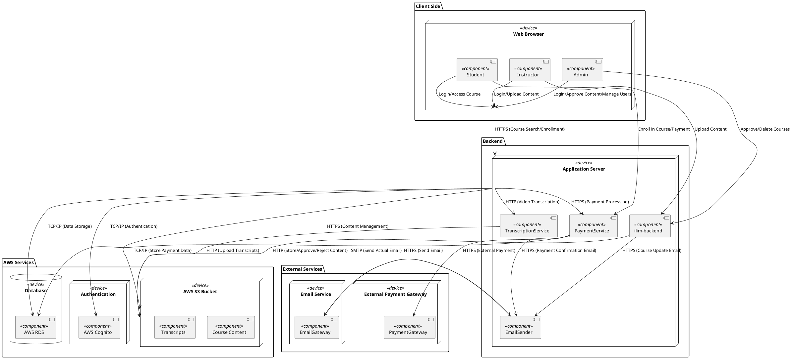

```plantuml
@startuml
package "Client Side" {
    node "Web Browser" <<device>> {
        [Student] <<component>>
        [Instructor] <<component>>
        [Admin] <<component>>
    }
}

package "AWS Services" {
    node "AWS S3 Bucket" <<device>> {
        [Course Content] <<component>>
        [Transcripts] <<component>>
    }
    
    node "Authentication" <<device>> {
        [AWS Cognito] <<component>>
    }
    
    database "Database" <<device>> {
        [AWS RDS] <<component>>
    }
}

package "Backend" {
    node "Application Server" <<device>> {
        [PaymentService] <<component>>
        [TranscriptionService] <<component>>
        [ilim-backend] <<component>>
        [EmailSender] <<component>>
    }
}

package "External Services" {
    node "External Payment Gateway" <<device>> {
        [PaymentGateway] <<component>>
    }
    
    node "Email Service" <<device>> {
        [EmailGateway] <<component>>
    }
}

[Student] --> [Web Browser] : Login/Access Course
[Instructor] --> [Web Browser] : Login/Upload Content
[Admin] --> [Web Browser] : Login/Approve Content/Manage Users

[Web Browser] --> [Application Server] : HTTPS (Course Search/Enrollment)

[Application Server] --> [AWS Cognito] : TCP/IP (Authentication)
[Application Server] --> [AWS RDS] : TCP/IP (Data Storage)
[Application Server] --> [AWS S3 Bucket] : HTTPS (Content Management)
[Application Server] --> [PaymentService] : HTTPS (Payment Processing)
[Application Server] --> [TranscriptionService] : HTTP (Video Transcription)

[PaymentService] --> [PaymentGateway] : HTTPS (External Payment)
[PaymentService] --> [AWS RDS] : TCP/IP (Store Payment Data)
[PaymentService] --> [EmailSender] : HTTPS (Payment Confirmation Email)

[ilim-backend] --> [AWS S3 Bucket] : HTTP (Store/Approve/Reject Content)
[ilim-backend] --> [EmailSender] : HTTPS (Course Update Email)
[TranscriptionService] --> [AWS S3 Bucket] : HTTP (Upload Transcripts)

[EmailSender] --> [EmailGateway] : HTTPS (Send Email)
[EmailGateway] --> [EmailSender] : SMTP (Send Actual Email)

[Admin] --> [ilim-backend] : Approve/Delete Courses
[Instructor] --> [ilim-backend] : Upload Content
[Student] --> [PaymentService] : Enroll in Course/Payment
@enduml

```