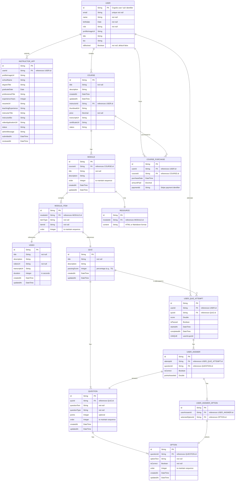

```mermaid
erDiagram
    USER {
        id String PK "Cognito user 'sub' identifier"
        email String "unique not null"
        name String "not null"
        birthdate Date "not null"
        role String "not null"
        profileImageUrl String
        title String
        bio String
        isBlocked Boolean "not null, default false"
    }

    INSTRUCTOR_APP {
        id String PK
        userId String FK "references USER.id"
        profileImageUrl String
        schoolName String
        degreeTitle String
        graduateDate Date
        professionalTitle String
        experienceYears Integer
        resumeUrl String
        teachingExperience String
        instructorTitle String
        instructorBio String
        videoApplicationUrl String
        status String
        adminMessage String
        submittedAt DateTime
        reviewedAt DateTime
    }

    COURSE {
        id String PK
        title String "not null"
        description String
        createdAt DateTime
        updatedAt DateTime
        instructorId String FK "references USER.id"
        thumbnailUrl String
        price Decimal "not null"
        transcriptUrl String
        certificateUrl String
        status String
    }

    MODULE {
        id String PK
        courseId String FK "references COURSE.id"
        title String "not null"
        description String
        order Integer "to maintain sequence"
        createdAt DateTime
        updatedAt DateTime
    }
    
    MODULE_ITEM {
        id String PK
        moduleId String FK "references MODULE.id"
        itemType String "not null"
        itemId String "not null"
        order Integer "to maintain sequence"
    }
    
    VIDEO {
        id String PK
        title String "not null"
        description String
        videoUrl String "not null"
        transcriptUrl String
        duration Integer "in seconds"
        createdAt DateTime
        updatedAt DateTime
    }
    
    QUIZ {
        id String PK
        title String "not null"
        description String
        passingScore Integer "percentage (e.g., 70)"
        createdAt DateTime
        updatedAt DateTime
    }
    
    QUESTION {
        id String PK
        quizId String FK "references QUIZ.id"
        questionText String "not null"
        questionType String "not null"
        points Integer "optional"
        order Integer "to maintain sequence"
        createdAt DateTime
        updatedAt DateTime
    }
    
    OPTION {
        id String PK
        questionId String FK "references QUESTION.id"
        optionText String "not null"
        isCorrect Boolean "not null"
        order Integer "to maintain sequence"
        createdAt DateTime
        updatedAt DateTime
    }
    
    USER_QUIZ_ATTEMPT {
        id String PK
        userId String FK "references USER.id"
        quizId String FK "references QUIZ.id"
        score Double
        isPassed Boolean
        startedAt DateTime
        completedAt DateTime
        UNIQUE userId-quizId
    }
    
    USER_ANSWER {
        id String PK
        attemptId String FK "references USER_QUIZ_ATTEMPT.id"
        questionId String FK "references QUESTION.id"
        isCorrect Boolean
        pointsAwarded Double
    }
    
    USER_ANSWER_OPTION {
        id String PK
        userAnswerId String FK "references USER_ANSWER.id"
        selectedOptionId String FK "references OPTION.id"
    }
    
    RESOURCE {
        id String PK
        moduleId String FK "references MODULE.id"
        content String "HTML or Markdown format"
    }
    
    COURSE_PURCHASE {
        id String PK
        userId String FK "references USER.id"
        courseId String FK "references COURSE.id"
        purchaseDate DateTime
        amountPaid Decimal
        paymentId String "Stripe payment identifier"
    }
    
    %% Relationships
    USER ||--o{ INSTRUCTOR_APP : "submits"
    
    USER ||--o{ COURSE : "creates"
    
    COURSE ||--|{ MODULE : "has"
    
    MODULE ||--|{ MODULE_ITEM : "contains"
    
    MODULE_ITEM ||--|| VIDEO : "references"
    
    MODULE_ITEM ||--|| QUIZ : "references"
    
    QUIZ ||--|{ QUESTION : "has"
    
    QUESTION ||--|{ OPTION : "has"
    
    USER ||--o{ USER_QUIZ_ATTEMPT : "attempts"
    
    QUIZ ||--o{ USER_QUIZ_ATTEMPT : "is attempted in"
    
    USER_QUIZ_ATTEMPT ||--|{ USER_ANSWER : "has"
    
    USER_ANSWER ||--|{ USER_ANSWER_OPTION : "has"
    
    USER_ANSWER_OPTION ||--|| OPTION : "selects"
    
    USER_ANSWER ||--|| QUESTION : "answers"
    
    MODULE ||--|| RESOURCE : "has"
    
    USER ||--o{ COURSE_PURCHASE : "buys"
    
    COURSE ||--o{ COURSE_PURCHASE : "purchased in"

```