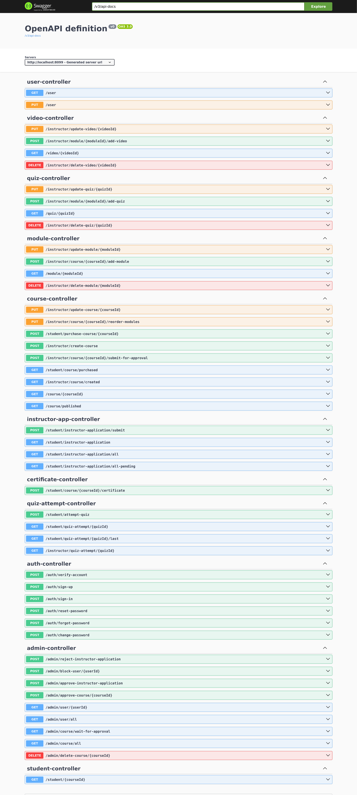

# ILIM Backend - Installation and Operation Guide

## Table of Contents

1. [Introduction](#introduction)
2. [System Architecture](#system-architecture)
3. [Prerequisites](#prerequisites)
4. [Deployment Guide](#deployment-guide)
    - [1. Setting Up Your Local Environment](#1-setting-up-your-local-environment)
        - [a. Clone the Repository](#a-clone-the-repository)
        - [b. Configure Environment Variables](#b-configure-environment-variables)
        - [c. Start PostgreSQL Locally](#c-start-postgresql-locally)
    - [2. Setting Up AWS Account and Infrastructure](#2-setting-up-aws-account-and-infrastructure)
        - [a. AWS CloudFormation Setup](#a-aws-cloudformation-setup)
        - [b. Update Local Configuration](#b-update-local-configuration)
    - [3. Building and Running the Server Locally](#3-building-and-running-the-server-locally)
        - [Using Maven and Running the JAR](#using-maven-and-running-the-jar)
    - [4. Configuring Kafka](#4-configuring-kafka)
        - [a. Verify Kafka Topics](#a-verify-kafka-topics)
        - [b. Watch Kafka Topic Locally](#b-watch-kafka-topic-locally)
        - [c. Produce a Test Message](#c-produce-a-test-message)
    - [5. Integrating with Payment Service](#5-integrating-with-payment-service)
        - [a. Running Stripe Local Webhook Server](#a-running-stripe-local-webhook-server)
5. [Administrative Operations](#administrative-operations)
    - [User Management](#user-management)
    - [Instructor Application Review](#instructor-application-review)
    - [Course Approval](#course-approval)
    - [System Monitoring](#system-monitoring)
6. [Maintenance and Troubleshooting](#maintenance-and-troubleshooting)
8. [Testing and Development](#testing-and-development)
9. [AWS Notes](#aws-notes)
10. [Implementation Details](#implementation-details)
11. [Support](#support)

---

## Introduction

Welcome to the **ilim-backend** Installation and Operation Guide! This document provides comprehensive instructions for deploying the ILIM backend system to a production server and offers administrative guidance for operating the system. It is intended for system administrators and DevOps engineers responsible for managing the deployment and maintenance of the ILIM platform.

## System Architecture

The **ILIM backend** is built using:

- **Java Spring Boot** for the application framework.
- **PostgreSQL** for the relational database.
- **AWS Services** including EC2, RDS, S3, and VPC for hosting and infrastructure.
- **AWS Cognito** for user authentication and authorization.
- **AWS SDK for Java** to interact with AWS services.
- **Spring Boot** as the application framework.
- **Docker Compose** for running PostgreSQL locally.
- **Kafka** (optional) for messaging between services.
- **AWS CloudFormation** to provision AWS resources.

## Prerequisites

Before you begin, ensure you have the following installed on your local development machine:

- **Java Development Kit (JDK) 21** or higher
- **Maven** for building the project
- **Git** for version control
- **Docker & Docker Compose** for running PostgreSQL locally

Additionally, ensure you have access to an **AWS Account** with permissions to create and manage EC2 instances, RDS databases, S3 buckets, and other resources.

## Deployment Guide

### 1. Setting Up Your Local Environment

#### a. Clone the Repository

```bash
git clone https://github.com/your-organization/ilim-backend.git
cd ilim-backend
```

#### b. Configure Environment Variables

1. Create the local configuration file:

   ```bash
   mkdir -p src/main/resources
   touch src/main/resources/application-local.properties
   ```

2. Populate `application-local.properties` with the following properties:

   ```yaml
   spring.datasource.url=jdbc:postgresql://localhost:5432/ilim-local-db
   spring.datasource.username=postgres
   spring.datasource.password=postgres
   spring.datasource.driver-class-name=org.postgresql.Driver

   # JPA and Hibernate
   spring.jpa.hibernate.ddl-auto=update
   spring.jpa.show-sql=true

   # AWS Cognito Configuration
   aws.cognito.userPoolId=your_cognito_user_pool_id
   aws.cognito.clientId=your_cognito_client_id
   aws.cognito.clientSecret=your_cognito_client_secret

   # JWT Configuration
   jwt.secretKey=your_jwt_secret_key
   ```

   **Note:** Replace placeholder values with your actual AWS Cognito and JWT configurations.

#### c. Start PostgreSQL Locally

1. Navigate to the Docker Compose directory:

   ```bash
   cd devops/local-db
   ```

2. Start the PostgreSQL container:

   ```bash
   docker-compose up -d
   ```

   **Note:** This will start a PostgreSQL instance accessible at `localhost:5432` with the database name `ilim-local-db`.

### 2. Setting Up AWS Account and Infrastructure

#### a. AWS CloudFormation Setup

1. Go to the root directory of the project.

2. Open `devops/setting-up-aws.md` using any markdown viewer.

3. Follow the instructions provided in `setting-up-aws.md` to provision necessary AWS resources using CloudFormation templates. This includes setting up VPC, RDS, EC2, and S3 as defined in the CloudFormation templates.

4. After provisioning, ensure that the AWS resources are correctly configured and secure.

#### b. Update Local Configuration

Ensure that `application-local.properties` includes all necessary configurations as guided by the AWS setup instructions in `setting-up-aws.md`.

### 3. Building and Running the Server Locally

#### Using Maven and Running the JAR

1. Build the application using Maven:

   ```bash
   ./mvnw clean package -DskipTests -P dev
   ```

2. Run the generated JAR file:

   ```bash
   java -jar target/ilim-backend-0.0.1-SNAPSHOT.jar
   ```

   **Note:** The server will start on `http://localhost:8099`.

### 4. Configuring Kafka

#### a. Verify Kafka Topics

To ensure Kafka is correctly set up, verify the existing topics:

```bash
docker exec -it local-kafka kafka-topics --bootstrap-server localhost:9092 --list
```

Ensure that the `paymentQueue` topic exists.

#### b. Watch Kafka Topic Locally

To monitor messages in the `paymentQueue` topic:

```bash
docker exec -it local-kafka kafka-console-consumer --bootstrap-server localhost:9092 --topic paymentQueue --from-beginning
```

#### c. Produce a Test Message

To verify that the Kafka consumer is working correctly, produce a test message:

1. Start the producer:

   ```bash
   docker exec -it local-kafka kafka-console-producer --broker-list localhost:9092 --topic paymentQueue
   ```

2. Enter a test message and press `Enter`.

   ```json
   {"userId":"test-user","courseId":"test-course","paymentId":"test-payment","paymentDate":"2024-04-27T12:00:00Z","status":"SUCCEEDED"}
   ```

3. Check the consumer to see if the message appears.

### 5. Integrating with Payment Service

#### a. Running Stripe Local Webhook Server

To handle Stripe webhooks locally, set up a secure tunnel using Serveo:

1. Run the following command to forward your local payment service port (e.g., `8081`) to a public URL:

   ```bash
   ssh -R 80:localhost:8081 serveo.net
   ```

2. Use the provided Serveo URL to configure Stripe webhooks, ensuring that Stripe can send webhook events to your local payment service.

   **Note:** Replace `8081` with the actual port your PaymentService is running on locally.

## Administrative Operations

### User Management

- **Viewing Users:**
    - Access the admin dashboard to view all registered users.
    - **Endpoint:** `GET /admin/user/all`

- **Blocking Users:**
    - Block a user by their user ID.
    - **Endpoint:** `POST /admin/block-user/{userId}`

- **User Details:**
    - Fetch detailed information about a specific user.
    - **Endpoint:** `GET /admin/user/{userId}`

### Instructor Application Review

- **Pending Applications:**
    - Retrieve all pending instructor applications.
    - **Endpoint:** `GET /student/instructor-application/all-pending`

- **Approve Application:**
    - Approve an instructor application.
    - **Endpoint:** `POST /admin/approve-instructor-application`

- **Reject Application:**
    - Reject an instructor application.
    - **Endpoint:** `POST /admin/reject-instructor-application`

### Course Approval

- **Courses Awaiting Approval:**
    - List all courses that are waiting for admin approval.
    - **Endpoint:** `GET /admin/course/wait-for-approval`

- **Approve Course:**
    - Approve a course by its course ID.
    - **Endpoint:** `POST /admin/approve-course/{courseId}`

- **Delete Course:**
    - Delete an inappropriate or outdated course.
    - **Endpoint:** `DELETE /admin/delete-course/{courseId}`

### System Monitoring

- **Logs:**
    - Monitor application logs to track errors and performance metrics.

- **Health Checks:**
    - Check health check endpoints or use AWS CloudWatch to monitor the health of services.

- **Scaling:**
    - Adjust EC2 instance sizes or configure Auto Scaling groups based on load and performance requirements.

## Maintenance and Troubleshooting

- **Database Backups:**
    - Regularly back up the RDS PostgreSQL instance using AWS automated snapshots.

- **Application Updates:**
    - Pull the latest code from the repository:
      ```bash
      git pull origin main
      ```
    - Rebuild and redeploy the application as per the [Building and Running the Server Locally](#3-building-and-running-the-server-locally) section.

## Testing and Development

- **API Endpoints:**
    - Access the Swagger UI at `http://localhost:8099/swagger-ui/index.html` to explore and test all available API endpoints.

- **API Testing Tools:**
    - Use tools like **Bruno** or **Postman** for testing API interactions.

- **Integration Tests:**
    - Run integration tests to ensure that different components of the system interact seamlessly.
    - **Note:** Integration tests are included in the final PR and can be executed using Maven:
      ```bash
      ./mvnw test
      ```


## AWS Notes

- **Cognito User Pool:**
    - The free tier of AWS Cognito allows up to 50 sign-ups per day. Monitor usage to stay within the free tier limits and avoid additional charges.

- **VPC Configuration:**
    - Use the `vpc.yaml` CloudFormation template to set up a secure Virtual Private Cloud with appropriate subnets, route tables, and internet gateways.

- **EC2 and RDS Placement:**
    - Deploy the server to an EC2 instance within a private subnet.
    - Place the RDS instance in a private subnet to enhance security.

## Implementation Details
- **Account Verification:**
    - When a user account is verified, it is created in the PostgreSQL database. Unverified accounts remain in Cognito with a status of 'unconfirmed'.

- **Payment Integration:**
    - The system integrates with Stripe for secure payment processing via a separate PaymentService. Sensitive financial data is handled by Stripe, ensuring that the backend does not directly manage or store financial information.

- **Asynchronous Messaging:**
    - Kafka is utilized for reliable message delivery between the PaymentService and the ILIM Back-End, ensuring that payment confirmations are processed efficiently.

### Support

If you need assistance:

1. Navigate to the **"Support"** page.
2. Submit a support issue by providing a title, description, and priority level.
3. The support team will respond to your inquiry via email.