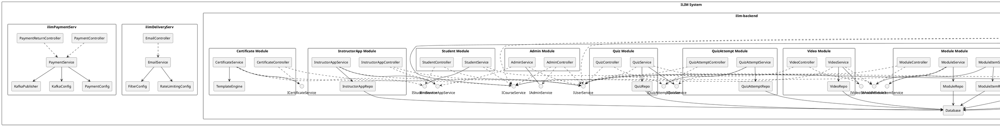

```plantuml
@startuml
' Define the component style
skinparam componentStyle rectangle
skinparam packageStyle rectangle

package "ILIM System" {

    package "ilim-frontend" {
        [User Interface] as UI
        [Presentation Logic] as PL
        [API Consumption] as AC
    }

    package "ilim-backend" {

        ' Define interfaces
        interface IAuthService
        interface IUserService
        interface ICourseService
        interface IModuleService
        interface IModuleItemService
        interface IVideoService
        interface IQuizService
        interface IQuizAttemptService
        interface IStudentService
        interface IInstructorAppService
        interface IAdminService
        interface ICertificateService

        package "Auth Module" {
            [AuthService] - [IAuthService]
            [AuthController] ..> [IAuthService]
            [CustomUserDetailsService]
            [SecurityConfig]
            
            [AuthService] --> [CustomUserDetailsService]
            [AuthService] --> [SecurityConfig]
        }

        package "User Module" {
            [UserService] - [IUserService]
            [UserController] ..> [IUserService]
            [UserRepo]
            
            [UserService] --> [UserRepo]
        }

        package "Course Module" {
            [CourseService] - [ICourseService]
            [CourseController] ..> [ICourseService]
            [CourseController] ..> [IUserService]
            [CoursePurchaseService]
            [CourseRepo]
            [CoursePurchaseRepo]
            
            [CourseService] --> [CourseRepo]
            [CourseService] --> [CoursePurchaseService]
            [CoursePurchaseService] --> [CoursePurchaseRepo]
        }

        package "Module Module" {
            [ModuleService] - [IModuleService]
            [ModuleController] ..> [IModuleService]
            [ModuleController] ..> [IUserService]
            [ModuleRepo]
            [ModuleItemService] - [IModuleItemService]
            [ModuleItemRepo]
            
            [ModuleService] ..> [ICourseService]
            [ModuleService] ..> [IModuleItemService]
            [ModuleService] --> [ModuleRepo]
            [ModuleItemService] --> [ModuleItemRepo]
        }

        package "Video Module" {
            [VideoService] - [IVideoService]
            [VideoController] ..> [IVideoService]
            [VideoController] ..> [IUserService]
            [VideoService] ..> [IModuleService]
            [VideoService] ..> [ICourseService]
            [VideoService] --> [VideoRepo]
        }

        package "Quiz Module" {
            [QuizService] - [IQuizService]
            [QuizController] ..> [IQuizService]
            [QuizController] ..> [IUserService]
            [QuizService] ..> [IModuleService]
            [QuizService] ..> [ICourseService]
            [QuizService] --> [QuizRepo]
        }

        package "QuizAttempt Module" {
            [QuizAttemptService] - [IQuizAttemptService]
            [QuizAttemptController] ..> [IQuizAttemptService]
            [QuizAttemptController] ..> [IUserService]
            [QuizAttemptService] ..> [IQuizService]
            [QuizAttemptService] --> [QuizAttemptRepo]
        }

        package "Student Module" {
            [StudentService] - [IStudentService]
            [StudentController] ..> [IStudentService]
            [StudentController] ..> [IUserService]
            [StudentService] ..> [ICourseService]
            [StudentService] ..> [IQuizAttemptService]
        }
        
        package "InstructorApp Module" {
            [InstructorAppService] - [IInstructorAppService]
            [InstructorAppController] ..> [IInstructorAppService]
            [InstructorAppController] ..> [IUserService]
            [InstructorAppService] --> [InstructorAppRepo]
            [InstructorAppService] ..> [IUserService]
        }

        package "Admin Module" {
            [AdminService] - [IAdminService]
            [AdminController] ..> [IAdminService]
            [AdminController] ..> [IUserService]
            [AdminController] ..> [ICourseService]
            [AdminService] ..> [IUserService]
            [AdminService] ..> [IInstructorAppService]
        }

        package "Certificate Module" {
            [CertificateService] - [ICertificateService]
            [CertificateController] ..> [ICertificateService]
            [CertificateController] ..> [IUserService]
            [CertificateService] ..> [ICourseService]
            [CertificateService] ..> [IStudentService]
            [CertificateService] --> [TemplateEngine]
        }

        package "Database" {
            [UserRepo] --> Database
            [CourseRepo] --> Database
            [CoursePurchaseRepo] --> Database
            [ModuleRepo] --> Database
            [ModuleItemRepo] --> Database
            [VideoRepo] --> Database
            [QuizRepo] --> Database
            [QuizAttemptRepo] --> Database
            [InstructorAppRepo] --> Database
        }

    }

    package "ilimDeliveryServ" {
        [EmailService]
        [EmailController] ..> [EmailService]
        [FilterConfig]
        [RateLimitingConfig]
        
        [EmailService] --> [FilterConfig]
        [EmailService] --> [RateLimitingConfig]
    }

    package "ilimPaymentServ" {
        [PaymentService]
        [PaymentController] ..> [PaymentService]
        [PaymentReturnController] ..> [PaymentService]
        [PaymentConfig]
        [KafkaPublisher]
        [KafkaConfig]
        
        [PaymentService] --> [PaymentConfig]
        [PaymentService] --> [KafkaPublisher]
        [PaymentService] --> [KafkaConfig]
    }

}

@enduml
```